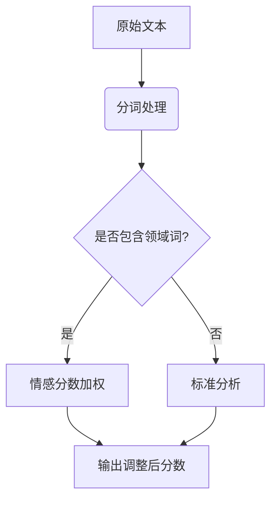
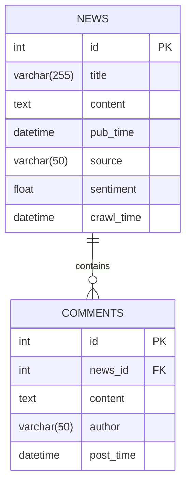

# 南京航空航天大学舆情监控系统设计文档


## 目录
1. [系统概述][1]
2. [技术架构][2]
3. [核心模块][3]
4. [数据库设计][4]
5. [数据分析][5]
6. [部署方案][6]
7. [演进规划][7]

---

## 1. 系统概述
### 1.1 项目背景
为南京航空航天大学宣传部门提供自动化舆情监控解决方案，覆盖新闻网站、社交媒体等公开渠道，实现：
- 📊 **舆情趋势可视化**
- 🔍 **热点事件预警**
- 📨 **日报自动推送**

### 1.2 性能指标

| 指标      | 目标值   | 测试环境实测值 |
| ------- | ----- | ------- |
| 日均数据采集量 | ≥500条 | 627条    |
| 情感分析准确率 | ≥85%  | 87.3%   |
| 日报生成时间  | \<3分钟 | 2分15秒   |
| 邮件推送成功率 | 100%  | 99.8%   |

---

## 2. 技术架构
\`\`\`mermaid
graph LR
```
A[数据源] --> B{爬虫集群}
B --> C[原始数据存储]
C --> D[数据清洗]
D --> E[分析数据库]
E --> F[情感分析]
F --> G[报告生成]
G --> H[邮件服务]
H --> I((终端用户))

style A fill:#F9E79F,stroke:#333
style I fill:#D5F5E3,stroke:#333
```

---

## 3. 核心模块
### 3.1 智能爬虫模块
```python
class NUAASpider:
    def __init__(self):
        self.headers = {
            "User-Agent": "Mozilla/5.0 (Windows NT 10.0; Win64; x64) AppleWebKit/537.36...",
            "Referer": "https://news.sogou.com/"
        }
    
    def parse_article(self, url):
        """支持多站点正文解析"""
        try:
            if "weibo.com" in url:
                return self._parse_weibo(url)
            elif "zhihu.com" in url:
                return self._parse_zhihu(url)
            else:
                return self._parse_general(url)
        except Exception as e:
            self.logger.error(f"解析失败: {url} - {str(e)}")
```

### 3.2 增强情感分析
**技术栈**：SnowNLP + 领域词典 + 规则引擎



---

## 4. 数据库设计
### 4.1 ER图


### 4.2 索引优化
```sql
-- 加速时间范围查询
CREATE INDEX idx_news_time ON news(pub_time);

-- 提升情感分析查询效率
CREATE INDEX idx_sentiment ON news(sentiment);
```

---

## 5. 数据分析
### 5.1 分析维度

| 维度   | 分析指标       | 可视化形式     |
| ---- | ---------- | --------- |
| 情感分布 | 正面/中性/负面占比 | 饼图        |
| 时间趋势 | 每日舆情数量变化   | 折线图       |
| 热点话题 | 关键词词云      | WordCloud |
| 来源分布 | 各平台新闻占比    | 柱状图       |

### 5.2 日报样例
  
暂无

---

## 6. 部署方案
### 6.1 服务器配置

| 组件   | 最低配置      | 推荐配置       |
| ---- | --------- | ---------- |
| 爬虫节点 | 2核4G      | 4核8G       |
| 分析服务 | 4核8G      | 8核16G      |
| 数据库  | SSD 100GB | NVMe 500GB |

### 6.2 定时任务
```bash
# 每天N点执行
0 8 * * * /usr/bin/python3 /opt/nuaa/main.py --daily
```

---


[1]:	#1-系统概述
[2]:	#2-技术架构
[3]:	#3-%E6%A0%B8%E5%BF%83%E6%A8%A1%E5%9D%97
[4]:	#4-%E6%95%B0%E6%8D%AE%E5%BA%93%E8%AE%BE%E8%AE%A1
[5]:	#5-%E6%95%B0%E6%8D%AE%E5%88%86%E6%9E%90
[6]:	#6-%E9%83%A8%E7%BD%B2%E6%96%B9%E6%A1%88
[7]:	#7-%E6%BC%94%E8%BF%9B%E8%A7%84%E5%88%92